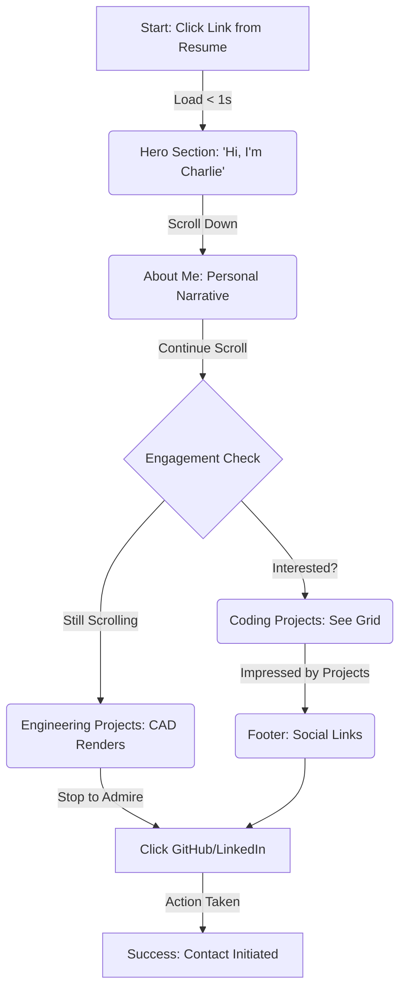
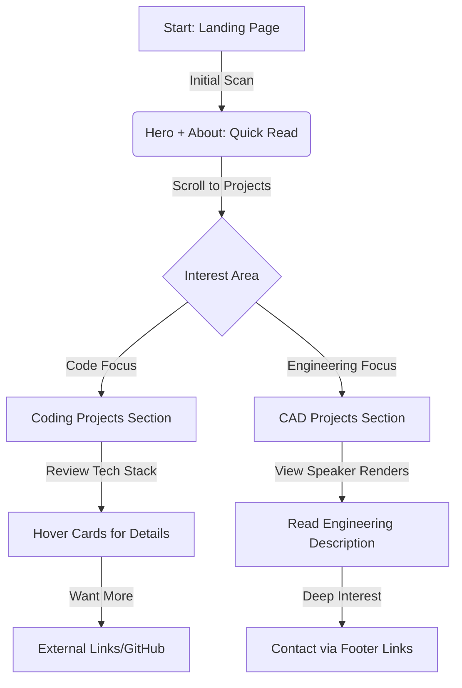

# UX Design Specification Personal_Website

**Author:** Charlie
**Date:** 2025-12-12

---

## Executive Summary

### Project Vision
Personal_Website is a modern, personality-first digital portfolio designed to bridge the gap between standard professional profiles and Charlie's true engineering depth. It aims to capture the "Mobile Recruiter" within 30 seconds through a "bright, modern" aesthetic while offering deep technical content (CAD drawings, engineering reports) for detailed review.

### Target Users
*   **Primary: "The Mobile Recruiter"** - Time-poor, mobile-first users needing immediate visual proof of capability ("The Signal in the Noise").
*   **Secondary: "The Network & Peers"** - Engineers and connections interested in learning from the detailed technical reports.

### Key Design Challenges
1.  **The "30-Second Hook" on Mobile:** Designing a landing experience that loads instantly and effectively communicates personality and skill before the user scrolls, specifically optimized for vertical mobile screens.
2.  **Complex Content, Simple UI:** Presenting dense engineering reports (Problem, Solution, Process, CAD images) in an "Article Style" that is readable and engaging on mobile devices without feeling like a PDF.
3.  **Balancing Personality with Professionalism:** Executing the "bright, modern" aesthetic (vibrant colors, glassmorphism) to show creativity without undermining the serious technical engineering credibility.

### Design Opportunities
1.  **"Scrollytelling" Reports:** Transform standard engineering reports into interactive narratives where images and text flow together, keeping the user engaged deeper into the content.
2.  **Micro-interactions as Skill Signifiers:** Use purposeful UI animations (hover effects, transitions) to subtly demonstrate frontend mastery to the recruiter without them needing to read code.
3.  **Visual "Project Cards":** High-impact thumbnails for the project grid that serve as the primary navigation, acting as "eye candy" to draw the user into the deeper content.

<!-- UX design content will be appended sequentially through collaborative workflow steps -->

## Core User Experience

### Defining Experience
The core experience is **"The 30-Second Conversion."** The user (Mobile Recruiter) lands on the site and must be immediately convinced of Charlie's engineering capability through visual signals and an "About Me" narrative, without initially needing to read deep technical content. The transition from "Skimming" to "Deep Reading" is the primary goal.

### Platform Strategy
*   **Primary Platform:** **Mobile (Portrait Mode).** The site must be "thumb-friendly" and readable on a phone screen, as recruiters are likely commuting or multitasking.
*   **Secondary Platform:** Desktop (for deep reading of reports later).
*   **Interaction Model:** Touch/Scroll-based. "Scrollytelling" is preferred over clicking through many pages to minimize friction.

### Effortless Interactions
1.  **Project Navigation:** Moving from the Home Grid to a Project Detail and back must be instantaneous. "One tap to depth, one tap to home."
2.  **Visual Loading:** High-quality renders must load progressively. A blank screen or loading spinner is a failure of the "Professionalism" signal.
3.  **Contact Access:** "Get in touch" should be effortlessly accessible at the moment of persuasion.

### Critical Success Moments
1.  **The "Hero" Load:** The first 3 seconds. If the "bright, modern" aesthetic doesn't hit immediately, the user bounces.
2.  **The "Detail" Transition:** The UI transition from Home to Project Detail should feel "Premium" (smooth, animated) to signal frontend mastery.
3.  **The "Skim" to "Read" Switch:** The moment a user stops rapidly scrolling images to actually read the Problem Statement of an engineering report.

### Experience Principles
1.  **Mobile First, Visual First:** Prioritize visual impact and vertical scrolling flow over dense text blocks on the landing page.
2.  **Performance is Professionalism:** Speed and smoothness are demonstrated proofs of engineering competence.
3.  **Depth on Demand:** Technical complexity (CAD, Code) should be accessible but not overwhelming upfront.
4.  **Personality as a Differentiator:** Use color, typography, and motion to break the "sterile portfolio" mold.

## Desired Emotional Response

### Primary Emotional Goals
1.  **Professional Delight:** The user should feel surprised that an engineering portfolio looks this good. "I expected a dry PDF, but I got a polished product."
2.  **Trust & Capability:** The design must subconsciously reassure the recruiter: "This person knows what they are doing."
3.  **Human Connection:** The user should feel they are meeting a **person**, not just reviewing a resume.

### Emotional Journey Mapping
1.  **Discovery (0-5s):** *Curiosity & Refreshment.* "Oh, this is clean. It's different from the others." (Breaking the monotony of reviewing resumes).
2.  **Exploration (5-30s):** *Engagement & Respect.* As they scroll through projects, they feel respected because the content is easy to digest and visually rich.
3.  **Deep Dive (30s+):** *Admiration.* Reading the detailed report confirms the intellect behind the visuals.
4.  **Exit:** *Memorability.* They leave feeling they found a "gem."

### Micro-Emotions
*   **Confidence:** Smooth scrolling and zero layout shifts create subconscious confidence in the developer's coding skills.
*   **Excitement:** Vibrant colors and glassmorphism invoke energy ("Bright"), contrasting with the "dull" competitor portfolios.
*   **Relief:** For the recruiter, finding a candidate who communicates clearly is a relief.

### Design Implications
*   **Trust:** Use generous whitespace and consistent typography to signal maturity. Clutter signals confusion.
*   **Delight:** Use subtle, non-intrusive hover effects on cards to make the interface feel "alive" without being annoying.
*   **Connection:** Use a friendly, conversational tone in the "About Me" and copy, matching the "bright" visual vibe.

### Emotional Design Principles
1.  **Don't be Boring:** It's a personal website, not a corporate bank site. Lean into personality.
2.  **Clarity is Kindness:** Don't make the recruiter hunt for info. Respect their time to build goodwill.

## UX Pattern Analysis & Inspiration

### Inspiring Products Analysis
1.  **Stripe / Framer (The "Bright & Modern" Vibe):**
    *   *Why:* They master the "Professional but Vibrant" look. Use of blurred gradients, crisp typography, and high-quality hero images.
    *   *Key Lesson:* You can be colorful without looking childish.
2.  **Linear / Raycast (The "Engineering Credibility"):**
    *   *Why:* They scream "High Performance." Use of subtle borders, glassmorphism, and keyboard-friendly micro-interactions.
    *   *Key Lesson:* Subtle visuals (like a 1px border shine) signal "I care about the details."
3.  **Apple Product Pages (The "Scrollytelling"):**
    *   *Why:* They sell complex hardware (like your speakers) using large visuals and scroll-triggered text reveal.
    *   *Key Lesson:* Don't dump text. Let the user scroll to reveal the story.

### Transferable UX Patterns
*   **The "Bento Grid" (from Linear/Apple):** Using a grid of cards for the Project Gallery to show variety at a glance.
*   **Scroll-Linked Animations (from Apple):** Fading elements in as the user scrolls to keep them engaged.
*   **Glassmorphism Cards (from macOS/Linear):** Using semi-transparent backgrounds to keep the UI feeling "light" and layered.

### Anti-Patterns to Avoid
*   **The "PDF Dump":** Just sticking a link to a PDF report. (We will use HTML "Article Style" instead).
*   **Scroll-Jacking:** Hijacking the scroll bar to force complex animations. (We will use *native* smooth scrolling).
*   **Generic "Bootstrap" Look:** Default blue buttons and standard shadows. (We need custom, refined CSS variables).

### Design Inspiration Strategy
*   **Adopt:** The "Stripe" color vibration for the landing page hook.
*   **Adapt:** The "Apple" scrollytelling for the *Bookshelf Speaker* project page, simplified for mobile performance.
*   **Avoid:** Over-complex WebGL loaders that block the user from seeing content immediately.

## Design System Foundation

### 1.1 Design System Choice
**Custom Design System (Vanilla CSS + CSS Variables).**
We will build a lightweight, semantic CSS architecture from scratch, avoiding heavy frameworks (Bootstrap, MUI) or utility classes (Tailwind) to ensure the code demonstrates pure frontend mastery.

### Rationale for Selection
1.  **Demonstration of Skill:** Writing clean, scalable CSS variables (`--color-primary-500`, `--ease-out-expo`) proves to recruiters that you understand the platform deeply, not just how to install a library.
2.  **Visual Uniqueness:** To achieve the "Bright, Modern" aesthetic (glassmorphism, specific blurs, custom easings), default libraries fight you. Custom CSS gives us pixel-perfect control over the "Apple-like" feel.
3.  **Performance:** No unused CSS bloat. The site will load instantly on mobile (Critical for the "30-Second Rule").

### Implementation Approach
*   **Token-Based Architecture:** We will define a `variables.css` file for Colors, Typography, Spacing, and Shadows.
*   **Component-Scoped Styles:** Using CSS Modules or BEM naming convention to keep styles encapsulated (e.g., `.ProjectCard__image`).
*   **Modern CSS Features:** heavy use of Grid, Flexbox, `backdrop-filter`, and CSS transitions (no heavy JS animation libraries where CSS suffices).

### Customization Strategy
*   **The "Glow" System:** We will create a custom set of shadow/glow tokens to create the "Bright" vibe.
*   **Typography:** We will use `Inter` or `Geist Sans` for that clean, technical look.

## 2. Core User Experience

### 2.1 Defining Experience
**The "Scrollytelling" Reveal.**
The core experience is a seamless, **single-page vertical scroll** narrative. As the user swipes up (on mobile) or scrolls (on desktop), the story unfolds in a deliberate sequence: "Hi, I'm Charlie" → "About Me" → "Coding Projects" → "Engineering Projects" → "Contact."

It transforms the passive act of "reading a resume" into an active journey of "discovering a candidate." Each section is revealed progressively, maintaining engagement through the entire "30-Second Conversion" window.

### 2.2 User Mental Model
*   **Current Model:** "I have to click through multiple pages, find a PDF link, pinch to zoom, and try to read tiny text to see if this candidate is good." (Frustrating, High Friction).
*   **New Model:** "I just scroll down. The content flows naturally to me, like an Instagram Story or an Apple product page. Everything is right here." (Effortless, Low Friction).

### 2.3 Success Criteria
1.  **Zero-Click Initial Engagement:** The user sees Introduction, About, and project previews *all on one page* without navigation clicks.
2.  **Fluidity:** No layout shifts. No jagged scrolling. Smooth 60fps scroll performance.
3.  **The "Hook":** The user must stop scrolling at the Engineering Projects section because the CAD renders look too professional to scroll past.
4.  **Clear Path:** Footer with contact links is always reachable by continuing the scroll—no hunting for navigation.

### 2.4 Novel UX Patterns
*   **Established:** The vertical scroll is the most natural mobile interaction.
*   **Novel Twist:** Applying Apple-style premium scrollytelling (usually for product marketing) to a **personal engineering portfolio**. We're treating the candidate as the product, with detailed engineering reports integrated into the narrative flow instead of hidden behind links.

### 2.5 Experience Mechanics
1.  **Initiation:** User lands at the Hero section. A subtle scroll indicator (↓ icon) encourages the first swipe.
2.  **Interaction:** User scrolls down vertically.
    *   *System Response:* Each section gracefully comes into view with subtle fade-in animations. Background gradient progresses from white to warmer tones.
    *   *Visual Feedback:* Section headers become prominent as they enter viewport.
3.  **Navigation:** Natural scroll is the primary navigation. Sections stack vertically in deliberate order.
4.  **Completion:** User reaches Footer with social links (GitHub, LinkedIn, Gmail) ready for action.

## Visual Design Foundation

### Color System
*   **Base Theme:** **Warm Light (White to Yellow).**
    *   *Backgrounds:* Soft gradient from pure white (`#FFFFFF`) to warm cream/pale yellow (`#FFFEF5`, `#FEFCF3`). Creates an inviting, approachable atmosphere.
    *   *Surfaces:* Subtle warm-tinted cards with gentle shadows. Use semi-transparent warm overlays (`rgba(255, 251, 235, 0.8)`) for depth and layering with glassmorphism.
    *   *Strategy:* The gradient creates visual interest without overwhelming—starts pristine white at the top, gently warming as the user scrolls down, like natural sunlight.
*   **The Single "Bright" Tone:**
    *   *Accent:* **Electric Azure (`#007AFF` or similar High-Vis Blue).**
    *   *Strategy:* We use **only this one hue** for *everything* "active"—buttons, glows, links, and hover states. The cool blue creates striking contrast against the warm background, providing a sharp, laser-focused "Engineering" look while maintaining visual harmony.

### Typography System
*   **Primary Font (Headings/Body):** **`Inter`** (or `Geist Sans`).
    *   *Why:* The gold standard for modern UI. Clean, neutral, high readability.
*   **Monospace Font (Code/Technical Details):** **`JetBrains Mono`** (or `Fira Code`).
    *   *Why:* Crucial for the "Engineering Report" sections. We will use this for technical data, numbers, and code snippets to signal "Developer."
*   **Hierarchy:** High contrast in size. Giant `h1` for the "Hook", highly legible `16px` or `18px` for body copy.

### Spacing & Layout Foundation
*   **8px Grid System:** Everything aligns to multiples of 8px (8, 16, 24, 32, 48, 64).
*   **"Airy" Density:** Generous whitespace (padding-block: 64px or 80px) between sections. We are selling *quality*, not density.
*   **Container Widths:**
    *   *Mobile:* 100% with 16px padding.
    *   *Report Reader:* max-width `65ch` (65 characters) for optimal reading comfort.
    *   *Gallery:* Wide container (`1200px`) for the grid.

### Accessibility Considerations
1.  **Contrast:** Strict WCAG AA compliance for all text. Dark text (#1a1a1a to #333) on light backgrounds ensures excellent readability. Azure accent (#007AFF) on white meets contrast requirements for interactive elements.
2.  **Reduced Motion:** Respect `prefers-reduced-motion` to disable complex scroll animations for users who are sensitive.
3.  **Tap Targets:** All touch targets minimum `44px` for mobile usability.

## Design Direction Decision

### Design Directions Explored
We explored three variations suited to the "Single Tone" theme:
1.  **Bento Grid:** High, organized density (Linear style).
2.  **Narrative:** Linear scrollytelling (Apple style).
3.  **Terminal:** Code-centric minimalist.

### Chosen Direction
**Direction B: Vertical Narrative Scroll with Light & Warm Theme.**

### Design Rationale
The user selected a **vertical scrollytelling layout** with a **light, warm color system** (white to yellow gradient). This provides:
- **Linear Story Flow:** Guides the recruiter through a curated journey: Introduction → About → Projects → Contact
- **Mobile-First Excellence:** Vertical scrolling is the most natural mobile interaction, perfect for "The Mobile Recruiter"
- **Focused Attention:** One section at a time keeps the user engaged without overwhelming choices
- **Recruiter-Focused:** Progressive disclosure—hook them with personality, prove capability with projects
- **Approachability:** Light backgrounds feel more welcoming than dark themes commonly seen in developer portfolios
- **Content Integration:** CAD renders and technical drawings (often white-background) integrate naturally
- **Professional Trust:** Clean, bright aesthetics signal polish and attention to detail
- **Apple-Style Premium:** Mimics the scrollytelling of premium product pages

### Page Structure (Single-Page Vertical Scroll)
The landing page follows a narrative arc optimized for "The 30-Second Conversion":

1. **Hero/Introduction Section**
   - Large, immediate visual hook: "Hi, I'm Charlie"
   - Brief tagline/role
   - Scroll indicator to encourage exploration

2. **About Me Section**
   - Personal narrative paragraph
   - Establishes personality and human connection
   - Readable, conversational tone

3. **Coding Projects Section**
   - Section header: "Coding Projects"
   - Project cards displayed as blocks/grid under header
   - Each card: thumbnail, title, tech stack, brief description
   - Hover states for interactivity

4. **CAD/Engineering Projects Section**
   - Section header: "Engineering Projects"
   - Featured project: Bookshelf Speaker Design
   - High-quality CAD renders
   - Brief description of engineering work

5. **Footer Section**
   - Social Icons: GitHub, LinkedIn, Gmail (Mail icon)
   - Clean, minimal design with centered iconography
   - Always accessible via scroll

### Color System Evolution
**Original:** Dark slate monochromatic theme  
**Updated:** Light & warm gradient (white → pale yellow)  
**Rationale:** The warm gradient creates a "sunlight effect" that feels inviting and professional, while the electric azure accent provides striking contrast for interactive elements.

### Implementation Approach
**Single-page vertical scroll layout** where content flows naturally:
- **Page Background:** Soft gradient from pure white (top) to warm yellow (bottom)
- **Sections:** Full-width with consistent vertical padding (80-120px)
- **Content Containers:** Max-width constrained for readability (1200px for project grids, 65ch for text)
- **Project Cards:** White/cream backgrounds with subtle warm shadows, displayed in responsive grid (2-3 columns on desktop, 1 column on mobile)
- **Interactive Elements:** Electric azure (#007AFF) for all links, buttons, and hover states
- **Smooth Scrolling:** Native CSS `scroll-behavior: smooth` for anchor links
- **Mobile:** Same vertical structure, single column, optimized spacing
- **Desktop:** Wider containers, multi-column project grids, generous whitespace

### Detailed Screen Specifications
For a granular, screen-by-screen breakdown of UI elements and interactions, please refer to: [Detailed UI Design Description](ux-design-screen-details.md)

## User Journey Flows

### Journey 1: The "30-Second Scroll" (Mobile Recruiter)
*Goal: Recruiter lands on phone, scrolls through entire page narrative, and feels impressed enough to contact.*

**Key Moments:**
- **0-3s:** Hero loads instantly, warm gradient visible, clear identity
- **3-10s:** About Me establishes personality, conversational tone hooks engagement
- **10-20s:** Coding Projects show breadth, tech stack signals capability
- **20-30s:** Engineering Projects (speaker CAD) provide the "wow" moment
- **30s+:** Footer links ready for immediate action (contact)

### Journey 2: The "Deep Dive" (Engineering Peer/Manager)
*Goal: Technical reviewer verifies depth and quality of engineering work.*

### Journey Patterns

1. **"Continuous Scroll" Navigation:**
   - All content on single page—no clicks required to see full narrative
   - Natural scroll is the only interaction needed
   - Sections automatically come into view as user scrolls

2. **"Progressive Hook" Engagement:**
   - Hero establishes identity immediately
   - About Me creates human connection
   - Projects provide proof of capability
   - Footer enables action

3. **"Frictionless Contact":**
   - No separate contact page to navigate to
   - Footer always reachable via scroll continuation
   - GitHub, LinkedIn, Gmail clearly visible and accessible

### Flow Optimization Principles

1.  **Zero Navigation Friction:** Single page eliminates all navigation decisions—just scroll
2.  **Thumb Zone Optimized:** On mobile, all interactive elements (project cards, footer links) are naturally in reach during scroll
3.  **Clear Visual Hierarchy:** Each section has clear headers, making it easy to scan content during scroll
4.  **Smooth Transitions:** CSS smooth scrolling and section fade-ins create premium feel
5.  **Always Forward:** No dead ends—footer is the natural conclusion with clear next actions

## Component Strategy

### Design System Components (The "Basics")
Since we are using **Vanilla CSS**, we don't have a pre-built library. We will create these foundational CSS classes first:
*   `.btn`: Primary and Secondary buttons (Azure accent style).
*   `.link`: Styled anchor tags for footer social links.
*   `.typography`: Global h1-h6 and body styles optimized for long-form reading.

### Custom Components (The "Special Sauce")

#### `HeroSection`
**Purpose:** The immediate visual hook at the top of the page.
**Anatomy:** Full-width section, centered content (max-width 800px), large heading (48-64px), subtitle, scroll indicator icon.
**Style:** Minimal, clean, centered alignment, generous top/bottom padding (100-150px).

#### `SectionHeader`
**Purpose:** Visual divider and content identifier for each major section.
**Anatomy:** Left-aligned heading (h2, 32-40px), optional subtitle, bottom margin before content.
**Style:** Bold weight, dark text (#1a1a1a), consistent spacing.

#### `ProjectCard`
**Purpose:** Reusable card component for displaying coding and engineering projects.
**Anatomy:** Container (`border-radius: 16px`, `bg-white`), Image/Thumbnail (top), Content Area (title, tech badges, description).
**States:**
*   *Default:* Soft shadow (`0 2px 8px rgba(0,0,0,0.06)`), subtle border (`1px solid rgba(0,0,0,0.08)`).
*   *Hover:* Border glows with azure accent, shadow deepens (`0 8px 16px rgba(0,0,0,0.12)`), slight lift (`translateY(-4px)`).

#### `TechBadge`
**Purpose:** Display technology stack tags (React, Node, CAD, etc.).
**Style:** Inline badges with azure text (#007AFF), monospace or semi-bold font, small size (0.875rem), subtle background.

#### `FooterIcons`
**Purpose:** Social contact access at the bottom of the page.
**Anatomy:** Horizontal row of SVG icons (GitHub, LinkedIn, Mail).
**Style:** 24x24px icons in neutral dark gray (#4B5563), hover state transitions to Azure blue (#007AFF) with subtle scale effect (`scale(1.1)`). Minimum 44px touch targets.

### Section-Specific Components

#### `AboutSection`
**Purpose:** Personal narrative content block.
**Anatomy:** Centered text container (max-width 65ch), readable paragraph typography.
**Style:** 16-18px body text, 1.6 line-height, dark gray (#333) on light background.

#### `ProjectsGrid`
**Purpose:** Container for project cards in the Coding Projects section.
**Layout:** CSS Grid, 2-3 columns on desktop, 1 column on mobile, gap of 24-32px.

#### `FeaturedProject`
**Purpose:** Large showcase for the Bookshelf Speaker CAD project.
**Anatomy:** Full-width or large card with prominent image, detailed description.
**Style:** White card background, larger than standard ProjectCard, emphasis on visual impact.

### Implementation Roadmap

**Phase 1 - Structure & Flow (Vertical Scroll)**
1. `HeroSection` (Introduction).
2. `AboutSection` (Personal narrative).
3. Page structure with smooth scroll behavior.

**Phase 2 - Project Showcase**
1. `SectionHeader` component.
2. `ProjectCard` (reusable for both sections).
3. `ProjectsGrid` layout.
4. `TechBadge` for skill display.

**Phase 3 - Engineering & Contact**
1. `FeaturedProject` (CAD speaker showcase).
2. `FooterLinks` (GitHub, LinkedIn, Gmail).
3. Scroll animations and polish.

## UX Consistency Patterns

### Interaction & Feedback
1.  **The "Lift" (Hover State):**
    *   *Rule:* All clickable cards (Projects, Blog) typically "lift" by `transform: translateY(-4px)` and increase shadow depth (from soft to medium).
    *   *Visual:* Border color shifts from subtle gray (`rgba(0,0,0,0.08)`) to azure accent (`var(--color-primary)`) with enhanced glow.
    *   *Cursor:* Always `cursor: pointer`.

2.  **The "Glow" (Focus State):**
    *   *Rule:* Keyboard focus (`:focus-visible`) matches the specific "Azure Glow" of the hover state but with an outline offset. We never use the default browser blue ring.

3.  **Active State (Tap):**
    *   *Rule:* Components shrink slightly (`scale(0.98)`) on click/tap to simulate tactile feedback.

### Transitions
1.  **Page Navigation (The "Shared Axis"):**
    *   *Pattern:* When navigating deeper (Grid -> Detail), the new page slides in from the **right** while the old page fades to the **left** and scales down (`scale(0.95)`).
    *   *Back:* The reverse happens (Slide from left).

2.  **Staggered Entrance:**
    *   *Pattern:* On initial load, items in a grid don't appear all at once. They cascade in (`animation-delay: 100ms * index`).

### Loading States
1.  **Skeleton Screens:**
    *   *Pattern:* We do *not* use spinners for content. We use "Shimmering Skeletons" that match the dimensions of the `BentoCard`.
    *   *Why:* Keeps the layout stable.

### Empty States (Search/Filter)
1.  **"No Results" Philosophy:**
    *   *Pattern:* Never just say "No results."
    *   *Action:* "No projects found with 'Rust'. Try 'Systems' or see [All Projects]."

## Responsive Design & Accessibility

### Responsive Strategy
**Philosophy: "Perfect on Phone, Expanded on Desktop."**
*   **Mobile (Portrait):** The primary platform. All content is vertically stacked. The "Bento Grid" collapses into a list of high-fidelity cards.
*   **Desktop (Landscape):** We use the extra width to show *connections*. The "Skill Ticker" moves from a narrow marquee to a sidebar or grid header.
*   **Tablet:** Treated as "Mobile with Padding." We don't build a bespoke tablet layout; we just ensure the container max-widths prevent lines from becoming unreadably long.

### Breakpoint Strategy
We use standard Tailwind/Standard CSS breakpoints (Mobile First):
*   `base`: Mobile (0px - 640px) -> Vertical Stack.
*   `md`: Tablet (640px - 1024px) -> 2-Column Grid.
*   `lg`: Desktop (1024px+) -> 3-Column / 4-Column Bento Layout.

### Accessibility Strategy
**Compliance Goal: WCAG 2.1 AA** (The standard).
1.  **Semantic HTML:** We use `<article>`, `<nav>`, `<main>`, and `<h1>` correctly. No `div` soup.
2.  **Focus Management:** Since we use "Cards as Links," the entire card is clickable, but we ensure the *focus ring* is visible and follows the tab order logically.
3.  **Color Blindness:** We rely on *labels* (e.g., "Node.js" text badge), not just *colors* (Green vs. Red), to convey status.

### Testing Strategy
1.  **The "Thumb Test":** I will verify (via simulation) that all primary navigation is reachable with a thumb on a standard phone screen.
2.  **Lighthouse Audit:** We will run a Google Lighthouse check to ensure we hit 100 on Accessibility.
